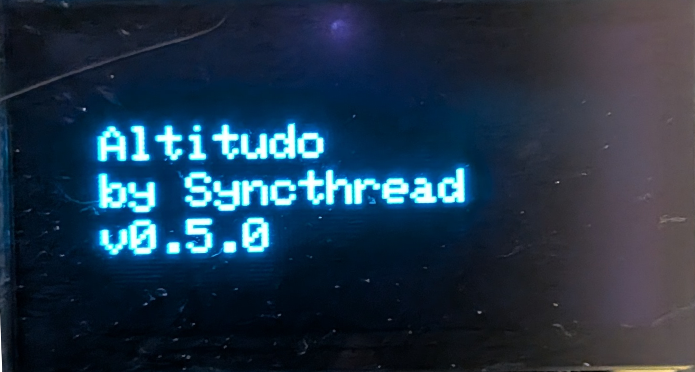

# Altitudo

**Altitudo** is an ESP32-based altimeter designed to be simple, compact but extensible. Current implementation has been developed with paramotor in mind, but it can be easily adapted to other outdoor activities.
It is based on the original [Altisense: Compact Altimeter Using ESP‑32](https://www.instructables.com/Altisense-Compact-Altimeter-Using-ESP32/) by Gokux, and extends its functionality with a modular codebase and support for multiple display types.

---

## Features

- **ESP32-S3 Supermini** support
- Modular driver architecture for multiple display types:
  - GxEPD2 (e-paper) (Note: some ESP32-C3 boards do not have enough harware pins for e-paper displays or SPI displays in general)
  - SH1106 (OLED)
  - SSD1306 (OLED)
- Simple UI
- Rotary encoder input support
- Easily extensible for new sensors and displays

---

## Getting Started

### Prerequisites

- ESP32 toolchain (Arduino IDE or PlatformIO)
- Required libraries (Install only the ones that suit your hardware):
  - [MS5611](https://github.com/RobTillaart/MS5611)
  - [GxEPD2](https://github.com/ZinggJM/GxEPD2)
  - [Adafruit SSD1306](https://github.com/adafruit/Adafruit_SSD1306)
  - [SH1106](https://github.com/jakiki6/SH1106) (or compatible)
- A supported display
- A rotary encoder with integrated push button
- A supported barometer
  - MS5611
  - (Coming soon) BMP585
- 2 10Kohm resistors
- wires
- (Optional) LiPo battery
- (Optional) Micro switch

Note: Instead of LiPo battery, the device can be powered through the ESP32 usb port using a powerbank 

### Building

1. Clone this repository.
2. Configure your hardware in `include/utils/hwconfig.h` (set `DISPLAY_TYPE`, pin assignments, etc.).
3. Open the project in your preferred IDE.
4. Download required libraries
5. Build and upload to your ESP32 board.

### Usage

> **Note:** The UI is currently under development and may change in future releases.

When powered on, Altitudo displays a 3-second splash screen:

After the splash, the main page appears. Depending on the selected options, compact or extended version of the page is shown.
In extended version, scroll through the pages using the encoder wheel.

  
  

To access the menu, press the encoder button. The menu page will be displayed:

  
  

Navigate through menu options by rotating the encoder. Press the encoder button to select an option and enter its configuration mode.

**Available menu options:**
- **Calibrate QNH:** Enter the sea level pressure for your current location.
- **Calibrate QFE:** Automatically set the current pressure as the baseline for height calculation.
- **Altimeter unit:** Choose between meters and feet.
- **Temperature unit:** Choose between Celsius and Fahrenheit.
- **Pressure unit:** Choose between hPa and inHg.
- **UI mode:** Choose between compact and standard.
- **Reset SPS:** restore standard pressure for both QNH and QFE

While in configuration mode, use the encoder wheel to adjust the setting. Press the encoder button again to confirm your selection and return to the menu page.

To return to the main page, select the "Back" option in the menu.

---

## Credits

- Original concept by [Gokux](https://www.instructables.com/member/Gokux/)
- Libraries by ZinggJM, RobTillaart, adafruit, jakiki6, and others

---

## License

This project is open source and available under the GPL 3.0 License.  
See [LICENSE](../LICENSE) for details.

---

## Status

**Under construction** — contributions and feedback are welcome!